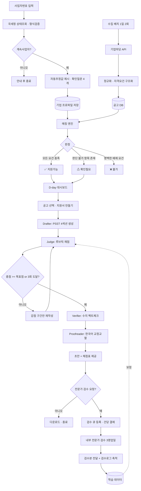
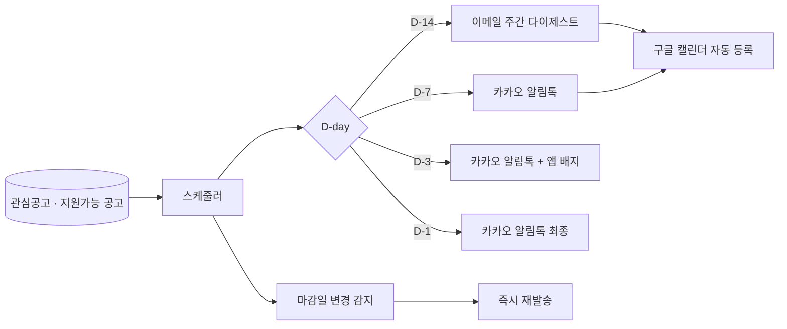
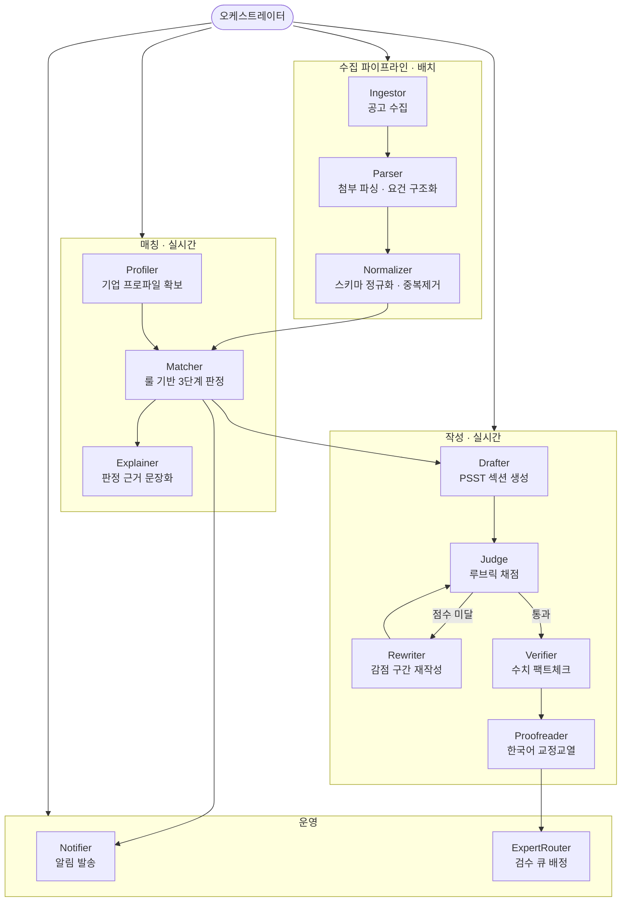

# 정부지원금·정책자금 자동 레이더 & 지원서 제작 플랫폼 기획서

> **한 줄 정의** — 사업자번호 하나로, 우리 회사가 지원 가능한 정부지원금·정책자금 일정을 자동으로 모아주고, 심사위원 관점으로 채점된 지원서 초안을 만들어, 분야 전문가 검수를 거쳐 받아보는 서비스.

| 항목 | 내용 |
|---|---|
| 문서 버전 | v1.0 (기획 확정본) |
| 작성일 | 2026-09-09 |
| 타깃 | 대한민국 중소기업 · 소상공인 |
| 문서 목적 | 바로 개발 착수 가능한 수준의 실행 기획서 |

---

## 0. 확정된 의사결정 요약

3라운드에 걸쳐 확정한 12개 결정입니다. 이후 모든 설계는 이 표를 전제로 합니다.

| # | 결정 항목 | 확정안 | 근거 |
|---|---|---|---|
| 1 | 기업 프로파일 확보 | **하이브리드** (무료 공개정보 자동 + 부족분만 확인질문) | 사업자번호만으로는 정보가 안 나옴. 유료DB는 초기 비용 부담 |
| 2 | MVP 데이터 소스 | **기업마당(bizinfo) 오픈API 단일 소스** | 중기부 통합 포털이라 커버리지 최대, API 안정적 |
| 3 | 지원서 산출물 | **PSST 섹션 초안 + 심사위원 채점표** | 2시간 MVP 가능, HWP 생성 난제 회피 |
| 4 | 수익모델 | **월 구독 + 검수 건당 정액** | 성공보수형은 정책자금 브로커 규제와 정면 충돌 |
| 5 | 매칭 판정 정책 | **3단계 분류 (가능 / 확인필요 / 불가)** | 미탐(놓침)과 오탐(신뢰 붕괴)을 동시에 방어 |
| 6 | 대시보드 메인 | **D-day 액션 중심** | 고객의 진짜 고통 = "마감을 놓친다" |
| 7 | 심사 엔진 강도 | **채점 → 자동 재작성 루프 (2~3회)** | 품질 차이가 가장 큼, 전문가 검수 시간도 절감 |
| 8 | 지원서 구조 | **PSST 4단계 고정** | 루브릭과 목차가 1:1로 맞아떨어져 루프 수렴이 빠름 |
| 9 | 기술 스택 | **Next.js + SQLite 단일앱** | 2시간 내 배포까지 가능, Postgres 이관 용이 |
| 10 | 알림 채널 | **카카오 알림톡 + 이메일 다이제스트 + 앱 내 배지** | 소상공인 열람률은 알림톡이 압도적 |
| 11 | 전문가 공급 | **초기에는 내부 인력이 직접 검수** | 검수 로그가 곧 AI 학습 자산 |
| 12 | 산출물 깊이 | **실행 가능한 상세 기획서** | 본 문서 |

---

## 1. 문제 정의

### 1.1 현재 상황

대한민국의 기업 지원사업은 **중앙부처 · 지자체 · 공공기관 · 출연연 · 테크노파크 · 보증기관**이 각각 독립적으로 공고를 냅니다.

- 공고 주체가 수백 곳으로 파편화되어 있고
- 공고가 **수시로 신설·변경·조기마감**되며
- 자격요건이 공고 본문이 아니라 **첨부 HWP/PDF 안**에 들어 있고
- 접수 기간이 짧게는 5영업일에 불과합니다.

### 1.2 그래서 생기는 고통

| 주체 | 고통 |
|---|---|
| 소상공인 대표 | 본업 하느라 공고를 볼 시간이 없음. 알았을 땐 이미 마감 |
| 중소기업 실무자 | 매주 5~6개 사이트를 수동 검색. 그래도 놓침 |
| 양쪽 공통 | 찾아도 "우리가 자격이 되는지" 판단에 30분~2시간 소요 |
| 양쪽 공통 | 자격이 돼도 사업계획서를 쓸 역량·시간이 없어 포기 |

### 1.3 성공의 정의

> **사업자번호를 넣으면 → 지원 가능한 일정이 자동으로 뜨고 → 지원서를 심사위원 관점으로 검토받아 → 분야 전문가 최종 검수를 거친 자료를 받는다.**

이것을 측정 가능한 형태로 바꾸면:

- 온보딩 3분 이내에 **지원 가능 공고 5건 이상** 제시
- 마감 7일 전 알림 **도달률 95% 이상**
- 지원서 초안 → 전문가 검수 완료까지 **3영업일 이내**
- 사용자가 체감하는 "찾는 시간" **주 3시간 → 주 10분**

---

## 2. 타깃과 페르소나

### 2.1 1차 타깃 (MVP 집중)

**업력 7년 이내, 상시근로자 50인 미만, 매출 100억 미만의 중소기업 / 소상공인.**

이 구간이 지원사업 수가 가장 많고(창업·성장 단계 집중), 내부에 전담 인력이 없어 고통이 가장 큽니다.

### 2.2 페르소나

**A. 김대표 (소상공인, 카페 2호점 준비, 업력 3년)**
- 정책자금이 뭔지는 아는데 어디서 신청하는지 모름
- 하루 12시간 매장에 있어 검색할 시간 없음
- 필요한 것: "나 지금 뭐 신청할 수 있어?" 한 방 답변 + 마감 알림톡

**B. 박과장 (제조 중소기업 경영지원팀, 직원 28명)**
- 매주 기업마당·K-스타트업·지자체 사이트를 수동 검색
- 사업계획서를 쓰긴 쓰는데 매번 떨어져서 이유를 모름
- 필요한 것: 놓침 없는 리스트 + "왜 떨어졌는지" 알려주는 채점표

### 2.3 타깃이 아닌 것 (범위 밖 선언)

- 상장사·대기업 (지원사업 대상이 아님)
- 개인 (사업자등록증이 없는 예비창업자는 2단계에서 확장)
- 정부 R&D 전문 과제 (별도 양식·난이도, 3단계)

---

## 3. 제품 구조: 두 개의 제품이 붙어 있다

이 서비스는 성격이 완전히 다른 두 모듈의 결합입니다. 이 구분을 놓치면 개발 우선순위가 무너집니다.

| | **A. 레이더 (일정)** | **B. 작성소 (지원서)** |
|---|---|---|
| 본질 | 데이터 파이프라인 문제 | 생성 품질 문제 |
| 성패 기준 | 빠짐없이 · 제때 | 심사 통과율 |
| 실패 모드 | 공고를 놓침 → 신뢰 붕괴 | 환각·상투어 → 탈락 |
| 비즈니스 역할 | **유입 (무료~저가 구독)** | **수익 (건당 정액)** |
| 개발 난이도 | 중 (지속적 유지보수 부담 큼) | 상 (품질 튜닝이 끝없음) |

> **전략**: A로 사용자를 모으고, B에서 돈을 번다. MVP는 **A를 얇게 완성 + B를 1건 시연**.

---

## 4. 기능 범위

### 4.1 MVP (2시간 프로토타입)

| # | 기능 | 상세 |
|---|---|---|
| M1 | 사업자 온보딩 | 사업자번호 형식검증 + 자동추정값 확인 + 부족항목 4개 입력 |
| M2 | 공고 수집 | 기업마당 오픈API 또는 사전 시드 JSON 100건 |
| M3 | 3단계 매칭 | 룰 필터 + 가중치 점수 → 가능 / 확인필요 / 불가 |
| M4 | D-day 대시보드 | 상단 액션카드 3건 + 캘린더 + 적합도 리스트 |
| M5 | 자격 판정 근거 | 항목별 ✅/❌/⚠ 와 판정 사유 문장 |
| M6 | PSST 초안 생성 | 선택 공고 1건에 대해 4섹션 초안 |
| M7 | 심사위원 채점 | 루브릭 100점 채점 + 감점 사유 + 수정 지시문 |
| M8 | 자동 재작성 | 감점 구간만 재작성 (최대 2회) |
| M9 | 검수 요청 스텁 | 버튼 클릭 → `요청접수` 상태 저장 (실제 사람 없음) |

### 4.2 P1 (1개월 내)

- K-스타트업 API 추가, 소상공인마당 연동
- 카카오 알림톡 발송 (D-14 / D-7 / D-3 / D-1)
- 이메일 주간 다이제스트
- 구글 캘린더 자동 등록
- 로그인 · 결제 (구독)
- 전문가 검수 실제 운영 (내부 인력 + 큐 관리)
- DOCX 다운로드
- 팩트 슬롯 검증 (환각 방지 강화)

### 4.3 P2 (3개월 내) — 추천 확장 기능

기존에 "나중에 할 것"으로 남겨두셨던 부분에 대한 제안입니다.

| 기능 | 왜 필요한가 |
|---|---|
| **중복지원 제한 자동체크** | 같은 연도 중복 수혜 제한 규정 위반은 즉시 탈락 사유. 이걸 잡아주면 신뢰가 급상승 |
| **증빙서류 체크리스트 자동생성** | 자격은 되는데 서류를 못 갖춰 포기하는 비율이 높음 |
| **선정/탈락 결과 피드백 학습** | 사용자가 결과를 입력하면 루브릭 가중치를 보정 → 유일한 방어 해자 |
| **유사기업 선정사례 벤치마크** | "우리와 비슷한 회사가 붙은 사업계획서" 요약 제공 |
| **사후관리 (정산·중간보고서)** | 선정 이후에도 붙잡아두는 리텐션 장치. LTV가 2배 |
| **지자체·테크노파크 크롤러** | 진짜 차별화 지점. 롱테일 커버리지가 곧 해자 |
| **컨설턴트 마켓플레이스** | 내부 검수 인력이 한계에 달했을 때의 확장 경로 |
| **팀 협업 · 버전관리** | 중소기업 실무자(박과장)가 대표 결재를 받는 흐름 지원 |

### 4.4 명시적 제외 (하지 않을 것)

- 대리 제출 / 대행 접수 → **행정 대리 및 브로커 규제 리스크**
- 성공보수 과금 → 동일 사유
- 선정 보장·합격률 광고 → 표시광고법 리스크
- 사용자 대신 서명·인증서 사용 → 절대 불가

---

## 5. 예시 입출력 (I/O 스펙)

### 5.1 온보딩

**입력**

```
사업자등록번호: 123-45-67890
[자동 조회 결과 확인] 계속사업자 / 일반과세자 ✓
[확인 질문 4개]
  업종: 제조업 > 식료품 제조 (C10)
  소재지: 경기도 화성시
  업력: 3년 2개월
  상시근로자: 12명
  직전연도 매출: 8.5억
```

**출력**

```
프로파일 생성 완료 — 적용 가능 필터 14종 활성화
```

### 5.2 대시보드

**출력 (핵심 화면)**

```
① 지금 해야 할 일 (D-day 액션카드 3건)
   [D-3]  경기도 중소기업 육성자금 융자          적합도 94점  ▶ 지원서 만들기
   [D-7]  스마트공장 구축지원(기초)              적합도 88점  ▶ 자격 확인하기
   [D-12] 소상공인 스마트기술 도입 지원          적합도 81점  ▶ 서류 준비하기

② 이번 달 캘린더 — 접수시작 5건 / 마감 8건 / 설명회 2건

③ 적합도순 리스트
   ✅ 지원가능 (7건)   ⚠ 확인필요 (4건)   ❌ 불가 (23건, 접힘)

④ 자격 판정 근거 (상세 드로어)
   업력 3년 이하        ✅  요건: 7년 이내 / 귀사: 3년 2개월
   소재지 경기도        ✅  요건: 도내 소재 / 귀사: 화성시
   매출 10억 미만       ✅  요건: 10억 이하 / 귀사: 8.5억
   여성기업 가산점      ❌  해당 없음 (감점 아님, 가점 미적용)
   업종 제한            ⚠  "제조업 중 뿌리산업 우대" — 세부 업종 확인 필요
   → 종합: 지원 가능 (가점 요건 1건 미충족)
```

### 5.3 지원서 제작

**입력**: 공고 선택 + `[지원서 만들기]`

**출력**

```
① PSST 4섹션 초안 (편집 가능)
   P. 문제인식     — 창업 배경 및 필요성, 목표 시장
   S. 실현가능성   — 제품·서비스 개발 방안, 경쟁력 확보
   S. 성장전략     — 사업화 전략, 자금 소요 및 조달
   T. 팀 구성      — 대표자 역량, 인력 운영 계획

② 심사위원 채점표
   문제인식      16 / 20   "시장 규모 근거가 인용 없이 서술됨"
   실현가능성    22 / 30   "개발 일정이 분기 단위로만 제시, 마일스톤 부재"
   성장전략      24 / 30   "매출 추정의 가정이 명시되지 않음"
   팀 구성       15 / 20   "핵심 인력의 유사 사업 경험이 드러나지 않음"
   ─────────────────────────
   총점          77 / 100   (통과 예상선 80점)

③ 자동 재작성 (2회 실행) → 총점 77 → 86
   변경 요약: 실현가능성 섹션에 월 단위 마일스톤 표 삽입 외 4건

④ 확인 필요 표시 (환각 방지)
   "국내 시장 규모 3,200억" ← 근거 미입력. 출처를 넣거나 삭제하세요
   "매출 전년 대비 30% 성장" ← 입력값(8.5억)과 대조 불가. 확인하세요

⑤ [전문가 최종 검수 요청]  예상 소요 3영업일 · 건당 정액
```

---

## 6. 기술적 병목 분석

실제로 발목을 잡을 순서대로 정리했습니다. 각 항목에 대응책과 MVP에서의 처리 방침을 함께 씁니다.

### B1. 사업자번호만으로는 정보가 거의 안 나온다 ★최대 병목

- **실체**: 국세청 오픈API가 주는 것은 사실상 *휴폐업 상태 · 과세유형* 뿐. 업종·업력·매출·근로자수는 나오지 않음.
- **영향**: "사업자번호만 넣으면"이라는 핵심 약속이 기술적으로 성립하지 않음.
- **대응 (확정)**: 하이브리드. 자동으로 채운 값을 **미리 보여주고 사용자는 확인만 하는 '확인형 폼'**으로 설계. 빈칸을 채우게 하는 것보다 이탈률이 크게 낮음.
- **MVP**: 형식검증 + 업종코드 자동추정 + 확인질문 4개.
- **P1 이후**: 유료 기업DB(NICE평가정보 / 한국기업데이터) 연동으로 진짜 "번호만 입력" 달성. 또는 중소기업현황정보시스템 확인서 업로드 파싱.

### B2. 공고 데이터의 파편화

- **실체**: 기업마당·K-스타트업은 오픈API가 있으나, 지자체·테크노파크·보증기관 수백 곳은 각자 게시판.
- **영향**: 커버리지가 곧 제품 가치인데 롱테일이 사실상 무한.
- **대응**: (1) API 소스 우선 → (2) 상위 트래픽 지자체 20곳 크롤러 → (3) 나머지는 RSS·이메일 구독 파싱. 소스별 `coverage_status`를 사용자에게 투명 공개("현재 중앙부처 100% / 경기도 80% / 기타 지자체 준비중").
- **MVP**: 기업마당 단일 소스. 커버리지 배지를 UI에 노출해 기대치를 관리.

### B3. 자격요건이 첨부파일(HWP/PDF) 안에 있다

- **실체**: 목록 API에는 요약만 있고, 진짜 조건은 공고문 본문·첨부에 있음. HWP 파싱은 고전 난제.
- **대응**: `hwpx`(XML 기반)는 파싱 가능 → 우선 처리. 구형 `hwp`는 PDF 변환 후 텍스트 추출 → LLM으로 구조화. 실패 시 **원문 링크 + "확인필요" 처리**로 안전하게 폴백.
- **MVP**: 파싱 안 함. API가 주는 메타데이터(지역·업종·대상)만으로 룰 매칭.

### B4. 매칭의 오탐 / 미탐

- **실체**: 놓친 공고 1건이 서비스 전체 신뢰를 무너뜨림. 반대로 다 보여주면 기업마당 원본과 다를 게 없음.
- **대응 (확정)**: 3단계 분류. 판단 불가하면 버리지 말고 **'확인필요'로 격리**. 이것이 이 서비스의 핵심 설계 원칙.
- **불변 규칙**: *애매하면 절대 '불가'로 보내지 않는다.*

### B5. 지원서의 환각

- **실체**: 매출·특허·인력·시장규모 같은 숫자를 LLM이 지어내면 즉시 탈락 사유이자 서비스 신뢰 파괴.
- **대응**: **팩트 슬롯 분리 아키텍처**. 생성 프롬프트에서 숫자는 `{{fact:revenue}}` 같은 슬롯으로만 쓰게 하고, 슬롯에 값이 없으면 **문장을 만들지 않고 `[확인 필요]` 배지**를 남김. 별도 Verifier 에이전트가 최종 산출물의 모든 수치를 프로파일과 대조.

### B6. 지정 HWP 양식 그대로 출력 요구

- **실체**: 대부분 공고가 지정 HWP 양식 제출인데 HWP 생성이 어려움.
- **대응 (확정)**: MVP·P1은 **섹션 초안 제공 → 사용자가 양식에 붙여넣기**. P1 후반에 DOCX 다운로드. HWP는 hwpx 한정 대응 또는 외부 변환 도구 검토.

### B7. 전문가 검수 공급

- **실체**: 사람이 병목. SLA를 못 지키면 클레임으로 직결.
- **대응 (확정)**: 초기 100건은 내부 인력이 직접 검수하고, **검수 로그(무엇을 어떻게 고쳤는지)를 구조화 데이터로 축적**. 이것이 나중에 AI 검수 품질과 컨설턴트 온보딩 매뉴얼의 재료가 됨.
- **안전장치**: 접수 상한(일일 N건) + 대기열 표시 + 초과 시 예약제.

### B8. 규제 리스크

- **실체**: 정책자금 컨설팅 영역은 브로커 문제로 감독이 강함. 성공보수형 수수료는 분쟁 소지가 큼.
- **대응 (확정)**: **구독 + 검수 건당 정액**. 대리 접수·성공 보장 문구는 전면 금지. 상세는 18장.

### B9. (부가) 데이터 신선도

- 공고 신설·조기마감이 수시 발생. **1일 2회 배치(오전 7시 / 오후 6시)** 를 기본으로 하고, D-3 이내 공고는 6시간마다 재확인. 마감 정보가 변경되면 즉시 알림 재발송.

---

## 7. 2시간 MVP: 범위와 타임박스

### 7.1 남기는 것 / 자르는 것

**남긴다**

- 기업마당 API 1소스 (키 발급 지연 대비 시드 JSON 100건 백업)
- 사업자번호 + 확인질문 4개 온보딩
- 룰 필터 + 가중치 점수 → 3단계 분류
- 대시보드 1화면 (액션카드 / 캘린더 / 리스트 / 상세 드로어)
- 공고 1건에 대한 PSST 초안 + 루브릭 채점 + 재작성 1회
- 검수 요청 버튼 (상태만 저장)

**자른다**

로그인 · 결제 · HWP 파싱 · HWP 생성 · 지자체 크롤러 · 알림 발송 · 유료 기업DB · 이력 관리 · 다중 사용자

### 7.2 분 단위 실행 계획

| 시간 | 작업 | 완료 기준 |
|---|---|---|
| 00–15 | 프로젝트 셋업 + 공고 데이터 확보 | `programs` 테이블에 100건 적재 |
| 15–35 | 스키마 + 매칭 룰 엔진 | 프로파일 넣으면 3단계 분류 결과 반환 |
| 35–50 | 온보딩 폼 | 5개 입력 → 프로파일 저장 → 리다이렉트 |
| 50–80 | 대시보드 UI | 액션카드 + 리스트 + 판정근거 드로어 렌더 |
| 80–105 | 지원서 생성 + 채점 | PSST 4섹션 + 100점 채점표 출력 |
| 105–115 | 재작성 루프 1회 + 검수요청 스텁 | 점수 상승 확인, 상태 저장 |
| 115–120 | 시드 데모 데이터 점검 + 마감 | 처음부터 끝까지 1회 시연 성공 |

### 7.3 데모 성공 판정

> 사업자번호를 넣고 → 3분 안에 → 적합 공고 리스트를 보고 → 1건을 골라 → 채점표가 붙은 지원서 초안을 화면에서 확인한다.

이 한 흐름이 끊김 없이 돌아가면 MVP 성공입니다. 그 외는 전부 부차적입니다.

---

## 8. 시스템 아키텍처

```
┌─────────────────────────────────────────────────────────────┐
│                        Next.js App                          │
│  ┌────────────┐  ┌─────────────┐  ┌──────────────────────┐  │
│  │ 온보딩     │  │ 대시보드    │  │ 지원서 에디터        │  │
│  │ /onboard   │  │ /dashboard  │  │ /application/[id]    │  │
│  └────────────┘  └─────────────┘  └──────────────────────┘  │
│                    Route Handlers (API)                     │
└───────────────┬─────────────────────────┬───────────────────┘
                │                         │
     ┌──────────▼──────────┐   ┌──────────▼───────────────┐
     │  매칭 엔진 (룰)     │   │  LLM 오케스트레이터      │
     │  결정적 · 설명가능  │   │  Drafter/Judge/Verifier  │
     └──────────┬──────────┘   └──────────┬───────────────┘
                │                         │
     ┌──────────▼─────────────────────────▼───────────────┐
     │              SQLite (→ Postgres 이관)              │
     │  companies · programs · rules · matches            │
     │  applications · sections · scores · expert_reviews │
     └────────────────────────┬───────────────────────────┘
                              │
     ┌────────────────────────▼───────────────────────────┐
     │            수집 배치 (cron, 1일 2회)               │
     │  기업마당 API → 정규화 → 룰 추출 → upsert          │
     └────────────────────────────────────────────────────┘
```

**설계 원칙**: 매칭은 **결정적 룰 엔진**(설명 가능해야 하므로 LLM 금지), 지원서 생성만 **LLM**. 이 경계를 흐리면 "왜 이 공고가 떴는지" 설명할 수 없게 됩니다.

---

## 9. 워크플로우

### 9.1 전체 흐름



### 9.2 알림 흐름



---

## 10. 서브에이전트 구조

### 10.1 구조도



### 10.2 에이전트 명세

| 에이전트 | 입력 | 출력 | 구현 | 핵심 실패 모드 | 방어책 |
|---|---|---|---|---|---|
| **Ingestor** | API 엔드포인트, 최종수집시각 | 원본 공고 JSON | 코드 (배치) | API 스펙 변경 · 요율 제한 | 스키마 검증 + 실패 시 이전 스냅샷 유지 |
| **Parser** | 공고 본문 / 첨부 HWP·PDF | 구조화 자격요건 | LLM + 파서 | HWP 파싱 실패 | 실패 시 전체를 '확인필요'로 표시 |
| **Normalizer** | 이종 소스 데이터 | 통합 스키마 | 코드 | 동일 공고 중복 | `기관+제목+마감일` 해시 dedupe |
| **Profiler** | 사업자번호 + 확인응답 | 기업 프로파일 | 코드 + API | 사용자 오입력 | 확인형 UI · 사후 수정 허용 |
| **Matcher** | 프로파일 + 자격요건 | 3단계 판정 + 점수 | **코드 (LLM 금지)** | 오탐 · 미탐 | 애매하면 무조건 '확인필요' |
| **Explainer** | 판정 결과 | 근거 문장 | LLM (저비용) | 근거 왜곡 | 룰 결과를 문장으로 옮기기만, 판단 금지 |
| **Drafter** | 공고 + 프로파일 + PSST 템플릿 | 4섹션 초안 | LLM | 환각 · 상투어 | 팩트 슬롯만 사용, 없으면 생성 금지 |
| **Judge** | 초안 + 루브릭 | 항목별 점수 + 감점사유 + 수정지시 | LLM | 점수 인플레 | 감점 사유 필수 기재 + 점수 상한 규칙 |
| **Rewriter** | 초안 + 수정지시 | 해당 섹션만 재작성 | LLM | 다른 섹션 훼손 | 섹션 단위 격리 재작성 |
| **Verifier** | 최종안 + 프로파일 | 미검증 수치 목록 | 코드 + LLM | 놓친 환각 | 모든 숫자·단위 정규식 추출 후 전수 대조 |
| **Proofreader** | 최종안 | 교정본 + 교정표 | `paper-proofread` 스킬 | 의미 변경 | 원문·수정문 병기 |
| **Notifier** | 매칭 결과 + D-day | 알림톡 · 이메일 | 코드 | 중복 발송 | 발송 이력 테이블로 멱등 처리 |
| **ExpertRouter** | 검수 요청 | 담당자 배정 + SLA 타이머 | 코드 | 큐 폭주 | 일일 접수 상한 + 대기열 노출 |

### 10.3 Judge → Rewriter 루프 종료 조건

무한 루프와 비용 폭주를 막기 위한 3중 종료 조건입니다.

1. 총점이 **목표점(기본 85점)** 이상
2. 재작성 **3회 도달**
3. 직전 대비 점수 상승폭이 **2점 미만** (수렴 판정)

종료 시 최고점 버전을 채택하고, 남은 감점 사유는 `[전문가 검수 권장 항목]`으로 표시해 인간에게 넘깁니다.

---

## 11. 데이터 모델

```sql
-- 기업 프로파일
companies (
  id, biz_no, name,
  status,              -- 계속사업자 / 휴업 / 폐업
  tax_type,            -- 일반 / 간이 / 면세
  industry_code,       -- 표준산업분류
  region_sido, region_sigungu,
  founded_at, employee_count, revenue_last_year,
  is_woman_owned, is_disabled_owned, is_social_enterprise,
  is_venture_certified, has_research_institute,
  profile_completeness,   -- 0~100, 매칭 정확도 안내용
  created_at, updated_at
)

-- 공고
programs (
  id, source,            -- bizinfo / kstartup / local
  source_uid,            -- 원본 고유키 (dedupe)
  title, agency, category,
  fund_type,             -- 지원금(보조) / 정책자금(융자) / 보증 / 바우처
  support_amount_min, support_amount_max,
  apply_start_at, apply_end_at, briefing_at,
  target_summary, url, attachment_urls,
  parse_status,          -- parsed / partial / failed
  raw_json, fetched_at
)

-- 구조화된 자격요건 (공고 1:N)
program_rules (
  id, program_id,
  field,                 -- founded_years / region / industry / revenue / employees ...
  operator,              -- lte / gte / in / not_in / exists / unknown
  value,
  is_disqualifier,       -- true=미충족 시 즉시 불가
  is_bonus,              -- true=가점 요건 (미충족해도 지원 가능)
  source_text            -- 판정 근거로 노출할 공고 원문 문장
)

-- 매칭 결과
matches (
  id, company_id, program_id,
  verdict,               -- eligible / needs_check / ineligible
  score,                 -- 0~100 적합도
  reasons_json,          -- 항목별 pass/fail/unknown + 근거 문장
  computed_at
)

-- 지원서
applications (
  id, company_id, program_id,
  status,                -- draft / scoring / review_requested / reviewed / submitted
  final_score, iteration_count, created_at
)

application_sections (
  id, application_id,
  section_key,           -- problem / solution / scaleup / team
  version, content, created_at
)

review_scores (
  id, application_id, iteration,
  criterion, score, max_score, comment, fix_instruction
)

fact_slots (
  id, application_id,
  slot_key,              -- revenue / employees / market_size / patents ...
  value, source,         -- profile / user_input / null
  is_verified
)

expert_reviews (
  id, application_id, assignee,
  status,                -- queued / in_progress / done
  requested_at, due_at, delivered_at,
  change_log_json        -- 무엇을 어떻게 고쳤는지 (학습 자산)
)

notifications (
  id, company_id, program_id,
  channel,               -- kakao / email / inapp / calendar
  dday, sent_at, status  -- 멱등 보장용
)
```

---

## 12. 매칭 엔진 설계

### 12.1 3단계 판정 규칙

```
for each rule in program_rules:
    result = evaluate(rule, company_profile)
    # result ∈ {PASS, FAIL, UNKNOWN}

판정:
  if any(FAIL where is_disqualifier)          → ❌ 불가
  elif any(UNKNOWN where is_disqualifier)     → ⚠ 확인필요
  elif program.parse_status != 'parsed'       → ⚠ 확인필요
  else                                        → ✅ 지원가능
```

> **불변 규칙 1** — UNKNOWN은 절대 FAIL로 취급하지 않는다.
> **불변 규칙 2** — 파싱이 불완전한 공고는 자동으로 '확인필요'로 내린다.
> **불변 규칙 3** — 가점 요건(is_bonus) 미충족은 판정에 영향을 주지 않고 점수에만 반영한다.

### 12.2 적합도 점수 (0~100)

| 요소 | 배점 | 산식 |
|---|---|---|
| 필수요건 충족률 | 40 | 충족 / 전체 필수요건 |
| 가점요건 충족률 | 20 | 충족 / 전체 가점요건 |
| 지원금 규모 적합도 | 15 | 기업 규모 대비 과대·과소 페널티 |
| 마감 임박도 | 15 | D-day가 가까울수록 상단 노출 (준비 불가 수준이면 감점) |
| 경쟁 강도 추정 | 10 | 전국 공모 < 지역 한정 < 업종 한정 순으로 가산 |

### 12.3 판정 근거 노출 규칙

모든 판정은 **공고 원문 문장(`source_text`)** 과 **기업 프로파일 값**을 나란히 보여줍니다. "AI가 그렇게 판단했다"는 절대 쓰지 않습니다. 이것이 신뢰의 기반이자, 규제 관점에서도 안전한 서술 방식입니다.

---

## 13. 지원서 생성 · 심사 루프 설계

### 13.1 PSST 4섹션 템플릿

| 섹션 | 키 | 핵심 질문 | 필요한 팩트 슬롯 |
|---|---|---|---|
| **P**roblem 문제인식 | `problem` | 왜 이 사업이 필요한가, 시장의 문제는 무엇인가 | 시장규모, 고객수, 문제 발생 빈도 |
| **S**olution 실현가능성 | `solution` | 어떻게 만들 것인가, 기술·역량은 있는가 | 개발 일정, 특허·인증, 기존 실적 |
| **S**cale-up 성장전략 | `scaleup` | 어떻게 팔고 얼마나 벌 것인가, 자금은 어디에 | 매출, 목표 매출, 자금 소요 내역 |
| **T**eam 팀 구성 | `team` | 누가 하는가, 왜 이 팀이 할 수 있는가 | 인원수, 경력, 조직 구성 |

### 13.2 기본 루브릭 (100점)

창업지원사업 계열 표준 평가표를 기준으로 하되, **공고별 배점표가 파싱되면 그것으로 대체**합니다.

| 평가항목 | 배점 | 세부 |
|---|---|---|
| 문제인식 | 20 | 시장 문제 정의의 구체성 · 근거 · 목표 고객 명확성 |
| 실현가능성 | 30 | 개발 방안 구체성 · 일정 현실성 · 보유 역량 · 차별성 |
| 성장전략 | 30 | 사업화 전략 · 매출 추정 근거 · 자금 집행 계획 타당성 |
| 팀 구성 | 20 | 대표자 역량 · 핵심 인력 · 외부 협력 체계 |

### 13.3 Judge 프롬프트 설계 원칙

1. **감점만 하고 가점하지 않는다.** 만점에서 출발해 결함마다 차감 → 점수 인플레 방지.
2. **모든 감점에 (a) 사유 (b) 해당 문장 인용 (c) 구체적 수정 지시**를 반드시 붙인다.
3. 수정 지시는 "더 구체적으로" 같은 추상어를 금지하고, **"분기 단위 일정을 월 단위 마일스톤 표로 바꾸고 각 마일스톤에 산출물을 적으시오"** 처럼 실행 가능한 형태로 쓴다.
4. 심사위원 페르소나는 **"해당 분야 10년차, 하루에 40건을 읽고 3건만 통과시키는 사람"** 으로 고정.

### 13.4 환각 방지: 팩트 슬롯 규약

- Drafter는 숫자를 **직접 쓸 수 없고** `{{fact:revenue}}` 형태의 슬롯만 사용
- 슬롯 값이 없으면 문장을 만들지 않고 `[확인 필요: 시장규모 근거]` 배지를 남김
- Verifier가 최종 산출물에서 모든 숫자·단위를 정규식으로 추출해 프로파일과 전수 대조
- 대조 불가 항목은 UI에서 **노란 하이라이트**로 표시하고, 전문가 검수 시 최우선 확인 대상으로 큐잉

---

## 14. 웹 대시보드 설계

### 14.1 화면 목록

| 화면 | 경로 | 역할 |
|---|---|---|
| 온보딩 | `/onboard` | 사업자번호 + 확인질문 4개 |
| **대시보드 (메인)** | `/dashboard` | D-day 액션 + 캘린더 + 적합도 리스트 |
| 공고 상세 | `/program/[id]` (드로어) | 판정 근거 · 원문 링크 · 서류 목록 |
| 지원서 에디터 | `/application/[id]` | 초안 편집 + 채점표 + 재작성 |
| 검수 요청 | `/review/[id]` | 요청 · 상태 추적 |
| 설정 | `/settings` | 프로파일 수정 · 알림 채널 |

### 14.2 대시보드 와이어프레임

```
┌───────────────────────────────────────────────────────────────────────┐
│  로고        (주)○○푸드 · 경기 화성 · 제조 C10 · 업력 3년   [프로파일]│
├───────────────────────────────────────────────────────────────────────┤
│  ▣ 지원가능 7건   ⚠ 확인필요 4건   📅 이번주 마감 3건   ✍ 작성중 1건 │  ← KPI 타일
├───────────────────────────────────────────────────────────────────────┤
│  🔥 지금 해야 할 일                                                    │
│  ┌─────────────────┐ ┌─────────────────┐ ┌─────────────────┐         │
│  │ D-3             │ │ D-7             │ │ D-12            │         │
│  │ 경기도 육성자금 │ │ 스마트공장 기초 │ │ 소상공인 스마트 │         │
│  │ 적합도 94       │ │ 적합도 88       │ │ 적합도 81       │         │
│  │ 최대 3억 융자   │ │ 최대 2천만 보조 │ │ 최대 5백만      │         │
│  │ [지원서 만들기] │ │ [자격 확인]     │ │ [서류 준비]     │         │
│  └─────────────────┘ └─────────────────┘ └─────────────────┘         │
├─────────────────────────────────────┬─────────────────────────────────┤
│  📅 2026년 9월                       │  📋 적합도순                    │
│  일 월 화 수 목 금 토               │  ✅ 지원가능 (7)                │
│         1  2  3  4  5               │   94 경기도 육성자금     D-3    │
│   6  7 [8] 9 10 11 12               │   88 스마트공장 기초     D-7    │
│  13 14 15 ●16 17 18 19              │   81 소상공인 스마트     D-12   │
│  20 21 ●22 23 24 25 26              │   …                             │
│  27 28 29 30                         │  ⚠ 확인필요 (4)   ▼            │
│  ● 마감  ○ 접수시작  ◆ 설명회        │  ❌ 불가 (23)      ▶ (접힘)     │
└─────────────────────────────────────┴─────────────────────────────────┘
```

### 14.3 시각화 컴포넌트 스펙

| 컴포넌트 | 형태 | 데이터 | 설계 노트 |
|---|---|---|---|
| KPI 타일 | 숫자 + 라벨 4개 | matches 집계 | 숫자만 크게. 스파크라인 금지(초기엔 노이즈) |
| D-day 액션카드 | 가로 카드 3장 | D-day 오름차순 × 적합도 | **D-3 이내는 빨강, D-7 이내는 주황** |
| 캘린더 | 월간 그리드 | apply_start / end / briefing | 점 마커 + 호버 시 공고명. 셀 클릭 → 리스트 필터 |
| 적합도 리스트 | 3그룹 아코디언 | verdict별 | **'불가'는 기본 접힘**. 펼치면 사유 표시 |
| 판정 근거 | 항목 테이블 | reasons_json | 좌: 공고 요구 / 우: 우리 회사 값 / 아이콘 |
| 채점표 | 가로 막대 4개 | review_scores | 배점 대비 획득 점수. **통과 예상선을 점선으로** |
| 점수 추이 | 라인 (반복 3점) | iteration별 총점 | 재작성 효과를 눈으로 보여주는 설득 장치 |
| 환각 경고 | 인라인 하이라이트 | fact_slots | 본문 안에 노란 배경 + 툴팁 |

### 14.4 색상·상태 규약

```
✅ 지원가능   green    — 모든 필수요건 충족
⚠  확인필요   amber    — 판단 불가 항목 존재 (절대 회색으로 죽이지 말 것)
❌ 불가       gray     — 명백한 배제 요건 (빨강 금지, 사용자 잘못이 아님)
🔥 D-3 이내   red
🟠 D-7 이내   orange
```

> **UI 원칙**: '불가'를 빨간색으로 칠하지 않습니다. 사용자의 실패가 아니라 단순 미해당이기 때문입니다. 반대로 '확인필요'는 눈에 띄어야 합니다. 여기에 기회가 숨어 있습니다.

---

## 15. 알림 설계

| 시점 | 채널 | 내용 |
|---|---|---|
| 매주 월 08:00 | 이메일 다이제스트 | 신규 공고 요약 + 이번 주 마감 |
| D-14 | 앱 내 배지 | 관심 등록 유도 |
| D-7 | 카카오 알림톡 | "○○ 지원사업 마감 7일 전 · 적합도 88점" |
| D-3 | 알림톡 + 배지 | 서류 체크리스트 링크 동봉 |
| D-1 | 알림톡 | 최종 리마인드 |
| 마감일 변경 감지 시 | 알림톡 즉시 | "마감일이 9/22 → 9/18로 변경되었습니다" |
| 관심 등록 시 | 구글 캘린더 | 접수시작 · 마감 · 설명회 일정 자동 등록 |

**구현 노트**
- 알림톡은 발신프로필 등록 + 템플릿 심사에 **1~2주** 소요 → P1 착수 시 가장 먼저 신청
- `notifications` 테이블에 `(company_id, program_id, dday, channel)` 유니크 제약으로 **중복 발송 원천 차단**
- 사용자별 알림 시간대 설정 (소상공인은 영업시간 중 알림을 싫어함 — 기본값 오전 8시)

---

## 16. 전문가 검수 운영 설계

### 16.1 초기 운영 (내부 직접 검수)

```
요청 접수 → 자동 사전정리 → 담당자 배정 → 검수 → 전달 → 로그 축적
   0h          0h              1h        ~2일     3일     동시
```

**자동 사전정리(검수 전 준비)** 가 검수 시간을 절반으로 줄입니다.
- Verifier가 표시한 미검증 수치 목록
- Judge가 남긴 잔여 감점 사유
- 공고 원문의 평가 기준 발췌
- 유사 공고 선정 사례 (있으면)

### 16.2 검수 체크리스트 (SOP)

1. 자격요건 재확인 — 시스템 판정이 맞는가
2. 미검증 수치 전수 확인 — 근거가 있는가, 없으면 삭제
3. 공고 평가지표와 목차 정합성
4. 분량·서식 규정 준수
5. 중복지원 제한 저촉 여부
6. 표현 교정 (과장 표현·미확정 사실 단정 제거)
7. 제출 서류 체크리스트 작성

### 16.3 SLA와 상한

- 표준 3영업일, 긴급(1영업일)은 할증
- **일일 접수 상한**을 두고 초과 시 예약제로 전환 (품질 붕괴 방지)
- 대기열 길이를 사용자에게 실시간 노출

### 16.4 검수 로그 = 핵심 자산

모든 수정은 `change_log_json`에 **(원문 / 수정문 / 수정 사유 / 대응 루브릭 항목)** 4쌍으로 기록합니다. 이 데이터가 쌓이면:

- Judge의 루브릭 가중치를 실제 통과 데이터로 보정
- Drafter의 few-shot 예시로 투입
- 신규 컨설턴트 온보딩 매뉴얼로 전환

---

## 17. 수익모델

| 플랜 | 가격 정책 | 포함 |
|---|---|---|
| **Free** | 무료 | 공고 레이더, 적합도 리스트, 앱 내 알림, 월 1건 초안 |
| **Pro** | 월 구독 | 무제한 초안, 알림톡, 캘린더 연동, 재작성 무제한, 서류 체크리스트 |
| **검수** | **건당 정액 (별도)** | 분야 전문가 최종 검수 + 수정본 + 제출 체크리스트 |
| **Partner** | 사무소 단위 연간 | 세무사·경영지도사 사무소가 다수 고객사를 관리 (2단계) |

> **절대 하지 않는 것**: 성공보수(선정 시 %), 선정 보장, 대리 접수. 가격은 시장 조사 후 확정하되 **모델 구조는 위에서 변경하지 않습니다.**

---

## 18. 규제·법적 리스크

| 리스크 | 내용 | 대응 |
|---|---|---|
| **정책자금 브로커 규제** | 정책자금 알선·성공보수 수취는 감독 대상 | 구독·정액제만. 대리 접수 절대 금지. 약관에 "정보제공 및 문서작성 지원 서비스"임을 명시 |
| **표시광고법** | "선정 보장", "합격률 90%" 등 | 성과 표현 전면 금지. 실적은 검증 가능한 형태로만 |
| **개인정보** | 사업자번호 + 대표자명 조합은 개인정보에 해당할 수 있음 | 최소 수집, 암호화 저장, 파기 정책 명시 |
| **공공데이터 이용약관** | 오픈API 재배포·상업적 이용 조건 | 각 API 이용약관 사전 검토. 출처 표기 |
| **크롤링** | robots.txt · 서버 부하 | API 우선, 크롤링은 저빈도·야간·User-Agent 명시 |
| **AI 작성 문서 제출** | 명시적 금지 규정은 드물지만 유사도 검사는 실재 | 최종 저작·제출 책임이 사용자에게 있음을 UI와 약관에 고지. 템플릿 문구 재사용 최소화 |
| **저작권** | 공고문 원문 전재 | 요약 + 원문 링크 방식. 전문 복제 금지 |

---

## 19. 추천 MCP · 스킬

### 19.1 MCP

| MCP | 용도 | 우선순위 |
|---|---|---|
| **커스텀 공공데이터 MCP** | 기업마당 · K-스타트업 · 국세청 상태조회 래핑 | ★★★ 직접 제작 권장 |
| **Google Calendar MCP** | 마감·설명회 일정 자동 등록 | ★★★ 이미 사용 가능 |
| **Playwright MCP** | 지자체·테크노파크 롱테일 크롤링 | ★★☆ P2 |
| **Supabase / Postgres MCP** | SQLite 졸업 후 운영 DB | ★★☆ P1 |
| **Slack / Notion MCP** | 내부 검수 큐 알림, 검수 로그 관리 | ★☆☆ 운영 편의 |
| **Filesystem MCP** | 첨부파일 · 산출물 관리 | ★☆☆ |

### 19.2 스킬

| 스킬 | 용도 |
|---|---|
| **`paper-proofread`** | 지원서 최종 한국어 교정교열. 이 서비스와 궁합이 가장 좋음 — Proofreader 에이전트에 그대로 연결 |
| **`docx`** | DOCX 산출물 생성 (P1) |
| **`pdf`** | 공고 첨부 PDF 파싱 |
| **`dataviz`** | 대시보드 차트 설계 규범 |
| **`artifact-design`** | 대시보드 시안 아티팩트 제작 |
| **`skill-creator`** | 심사위원 루브릭을 재사용 가능한 사내 스킬로 고정 |

---

## 20. 로드맵

| 단계 | 기간 | 목표 | 완료 기준 |
|---|---|---|---|
| **Phase 0** | 2시간 | 동작하는 MVP | 온보딩→매칭→초안→채점 1회 완주 |
| **Phase 1** | 2주 | 실사용 가능 | 로그인·결제, 알림톡, 소스 2개, DOCX |
| **Phase 2** | 6주 | 검수 운영 시작 | 내부 검수 100건 처리, 로그 축적 |
| **Phase 3** | 3개월 | 커버리지 확장 | 지자체 20곳 크롤러, 중복지원 체크, 결과 피드백 학습 |
| **Phase 4** | 6개월 | 확장 | 파트너 채널, 컨설턴트 마켓플레이스, 사후관리 |

---

## 21. KPI

| 구분 | 지표 | 초기 목표 |
|---|---|---|
| **레이더** | 온보딩 완료율 | 60% 이상 |
| | 온보딩당 평균 제시 공고 수 | 5건 이상 |
| | 공고 누락률 (샘플 감사) | 5% 이하 |
| | 알림 도달률 | 95% 이상 |
| **작성소** | 초안 생성 → 검수 요청 전환율 | 15% 이상 |
| | 재작성 루프 평균 점수 상승 | +8점 이상 |
| | 미검증 수치 잔존율 | 0건 (Verifier 통과 기준) |
| **운영** | 검수 SLA 준수율 | 95% 이상 |
| **비즈니스** | 무료 → 유료 전환율 | 5% 이상 |
| | 월 리텐션 | 40% 이상 |

---

## 22. 열린 이슈 (다음 논의 대상)

1. **가격 확정** — 구독 월액과 검수 건당 단가. 경쟁 컨설팅 시세 조사 필요
2. **유료 기업DB 도입 시점** — "번호만 입력" 약속을 언제 완성할 것인가
3. **HWP 출력 전략** — hwpx 한정 대응으로 갈 것인가, 외부 변환 도구를 쓸 것인가
4. **커버리지 공개 수준** — "경기도 80%" 같은 수치를 사용자에게 얼마나 투명하게 보여줄 것인가
5. **검수 인력 확장 트리거** — 월 몇 건에서 외부 컨설턴트를 붙일 것인가
6. **결과 피드백 수집 방법** — 사용자가 선정/탈락 결과를 입력하게 만들 유인 설계

---

## 부록 A. 확인질문 4개 (온보딩 확정안)

| # | 질문 | 형태 | 매칭에서 쓰이는 곳 |
|---|---|---|---|
| 1 | 주요 업종이 무엇인가요? | 자동추정값 확인 + 수정 | 업종 제한 요건 |
| 2 | 사업장 소재지는? | 시/도 → 시/군/구 선택 | 지자체 공고 필터 (가장 강력) |
| 3 | 상시근로자 수는? | 구간 선택 (1인 / 2-4 / 5-9 / 10-49 / 50+) | 소상공인·중기업 구분 |
| 4 | 직전연도 매출액은? | 구간 선택 (1억 미만 ~ 100억 이상) | 규모 요건 |

**업력**은 사업자등록 상태조회로 개업일 추정이 가능하면 자동 채움, 아니면 5번째 질문으로 추가합니다.

> **UI 원칙**: 정확한 값을 요구하지 않고 **구간**으로 받습니다. 대표님들이 정확한 숫자를 기억하지 못해 이탈하는 것이 가장 큰 손실입니다.

## 부록 B. MVP 체크리스트

- [ ] 기업마당 API 키 발급 신청 (지연 대비 시드 JSON 병행)
- [ ] Next.js 프로젝트 생성 + SQLite 스키마 마이그레이션
- [ ] 공고 100건 적재 및 정규화 확인
- [ ] `program_rules` 수기 작성 (상위 20건만, 나머지는 확인필요 처리)
- [ ] 매칭 엔진 단위 테스트 (3단계 판정이 규칙대로 나오는가)
- [ ] 온보딩 폼 → 프로파일 저장
- [ ] 대시보드 렌더 (액션카드 · 캘린더 · 3그룹 리스트)
- [ ] 판정 근거 드로어
- [ ] Drafter 프롬프트 (팩트 슬롯 규약 포함)
- [ ] Judge 프롬프트 (감점 방식 · 수정지시 필수)
- [ ] 재작성 루프 1회 + 점수 변화 표시
- [ ] 검수 요청 버튼 → 상태 저장
- [ ] 전체 흐름 1회 완주 리허설

---

*본 문서는 3라운드 의사결정을 통해 확정된 기획안이며, 코드 구현 전 단계의 산출물입니다.*
